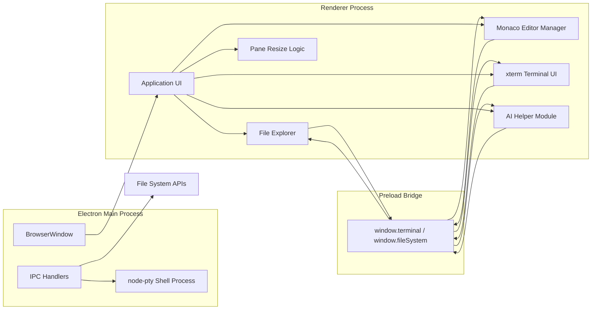
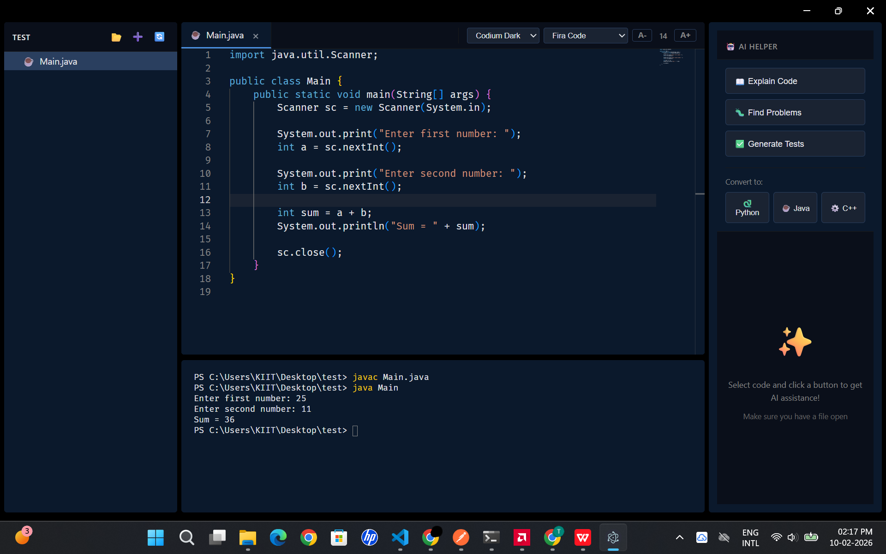
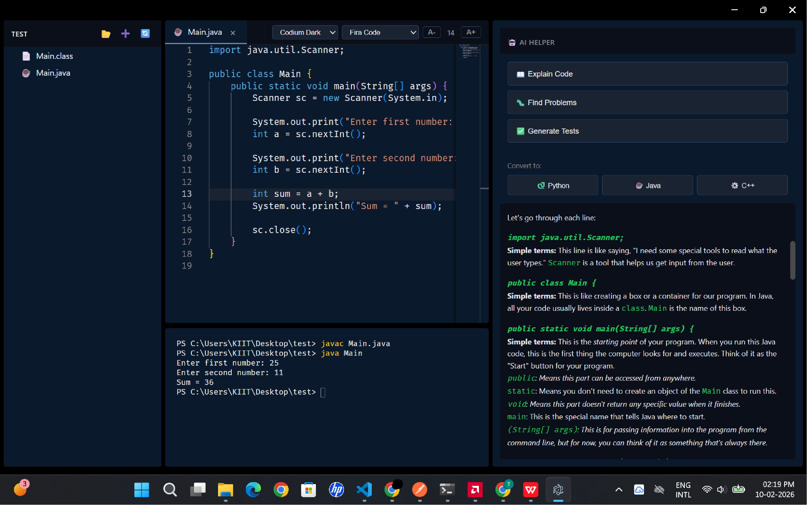
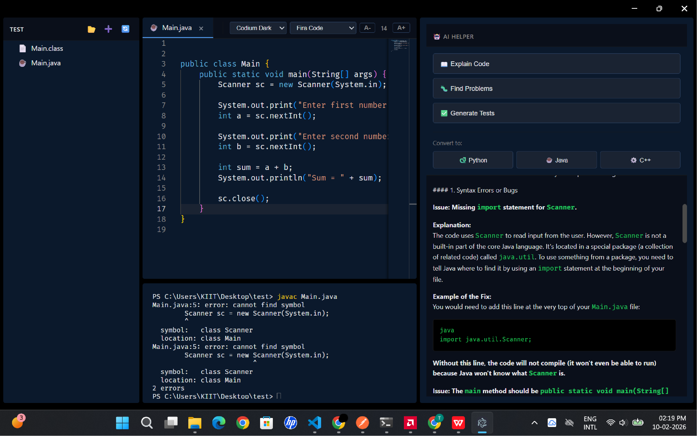
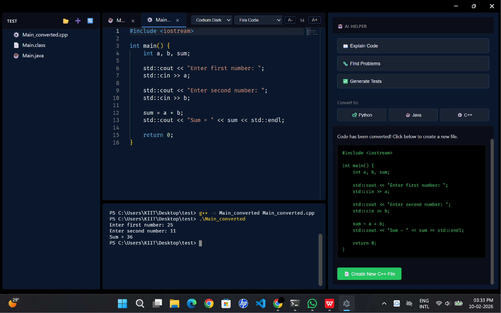

# Codium

A polished desktop coding workspace built with Electron, Monaco Editor, and xterm.js to deliver a fast, local-first development experience for browsing projects, editing source files, and interacting with a terminal.

---


---

## 🌐 Overview

Codium is a desktop-first coding environment designed for focused development sessions. It combines a project explorer, a powerful editor surface, an integrated terminal, and an AI-assisted helper module into a single application that keeps the workflow local and fluid.

The experience is centered around core software development tasks: navigating a workspace, opening and editing files, saving changes, running shell commands, and invoking AI assistance without leaving the app.

---

## ✨ Feature Set

- 📁 Browse local directories and project structures through a dedicated explorer UI
- ➕ Create, rename, delete, refresh, and navigate files and folders
- 📝 Edit code in a Monaco-powered editor with tabbed document handling and modified-file awareness
- 🎨 Switch themes and adjust font size for a more comfortable editing experience
- 🖥 Run shell commands directly from an integrated terminal pane
- 📐 Resize the explorer, editor, and terminal layout with draggable split panes
- 🔐 Access the local filesystem through Electron IPC in a structured, renderer-safe way
- 🤖 Invoke AI-powered assistance for code understanding, debugging feedback, test generation, and language conversion

---

## 🤖 AI Features

The application uses the Gemini Ask API for all AI-powered features. The backend repository is [Gemini Ask API](https://github.com/tusharAgarwal2511/Gemini-ask-api), and the backend is powered by Gemini 2.5 Flash.

The capabilities it implements include:

- 🧠 Explain selected code in simple, beginner-friendly language
- 🔎 Identify potential problems, bugs, or issues in the active source file
- ✅ Generate practical test cases for the current code
- 🔄 Convert code into Python, Java, or C++
- 📄 Create a new file from converted output for immediate use

These capabilities are implemented in the renderer-side helper logic and are routed through the backend service for AI responses.

---

## 🧰 Tech Stack

- [Electron](https://www.electronjs.org/) – desktop application shell and window management
- [Node.js](https://nodejs.org/) – runtime and main-process orchestration
- [Monaco Editor](https://microsoft.github.io/monaco-editor/) – code editing experience
- [xterm.js](https://xtermjs.org/) – terminal rendering and interaction
- [xterm-addon-fit](https://github.com/xtermjs/xterm.js/tree/master/addons/xterm-addon-fit) – terminal layout and resizing
- [node-pty](https://github.com/microsoft/node-pty) – shell process spawning and terminal backend

---

## 🧩 System Architecture

A concise low-level view of the application structure and communication flow.



---

## 📁 Project Structure

- main.js – Electron main process that creates the app window, launches the shell process, and handles file-system and terminal IPC
- preload.js – exposes the renderer-safe API bridge for terminal and file-system access
- renderer/ – UI and editor modules
  - index.html – application layout and script loading
  - app.js – editor and tab orchestration logic
  - file-explorer.js – explorer tree rendering and file actions
  - monaco-integration.js – Monaco initialization and document management
  - terminal.js – terminal initialization and I/O wiring
  - script.js – pane resizing behavior
  - style.css – styling for the desktop interface
- main.cpp – sample C++ program included in the repository

---

## 📸 Screenshots

| Screenshot | Preview |
|---|---|
| Home screen |  |
| Explain code |  |
| Find problems |  |
| Generate tests |  |

---

## 🚀 Getting Started

### Prerequisites

- Node.js and npm

### Installation

```bash
npm install
```

### Run the application

```bash
npm start
```

### Typical workflow

1. Open a folder from the explorer pane.
2. Navigate and open files in the editor.
3. Use the tabs to switch between open documents.
4. Run shell commands from the integrated terminal.
5. Invoke the AI helper for code explanation, debugging help, tests, or code conversion.

---

## 📝 Notes

The current implementation provides a complete desktop editor shell with workspace navigation, file editing, terminal access, and an integrated AI helper module. The core IDE experience is active, and the assistant features are implemented in the codebase for use through the app’s AI-driven panel.
