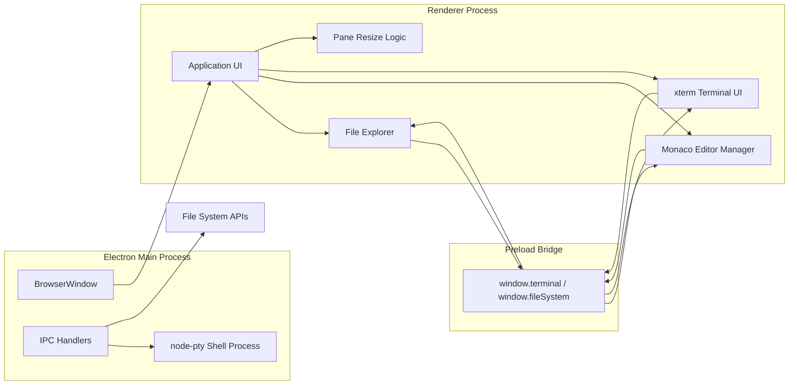

# Codium

A desktop coding workspace built with Electron that brings together a file explorer, a Monaco-powered editor, and an integrated terminal in a single local application.

---


---

## 🌐 Overview

Codium is a lightweight desktop editor for browsing local folders, editing source files, and interacting with a terminal without leaving the app. The current implementation focuses on the workspace experience: navigating files, opening and editing documents, switching between tabs, and running shell commands from an integrated terminal pane.

---

## ✨ Features

- 📁 File explorer UI for browsing local directories and files
- ➕ Create, rename, delete, and refresh files or folders from the explorer
- 📝 Monaco-based editor with tabbed document handling and unsaved-change awareness
- 🎨 Editor controls for switching themes and adjusting font size
- 🖥 Integrated terminal powered by xterm.js and node-pty
- 📐 Resizable split panes for the explorer, editor, and terminal areas
- 🔐 IPC-based file-system access between the Electron main process and renderer

---

## � Screenshots

| Screenshot | Preview |
|---|---|
| Main workspace layout |  |
| Explorer and editor view |  |
| Terminal integration |  |

> If you add more screenshots to the repository, place them in the images folder and update this table accordingly.

---

## �💻 Tech Stack

- [Electron](https://www.electronjs.org/) – desktop application shell
- [Node.js](https://nodejs.org/) – main-process logic and runtime
- [Monaco Editor](https://microsoft.github.io/monaco-editor/) – code editor experience
- [xterm.js](https://xtermjs.org/) – terminal rendering
- [xterm-addon-fit](https://github.com/xtermjs/xterm.js/tree/master/addons/xterm-addon-fit) – terminal sizing and layout
- [node-pty](https://github.com/microsoft/node-pty) – shell process integration

---

## 🧩 System Architecture

Low-level design view of the main application modules and how they communicate.



---

## 📁 Project Structure

- main.js – Electron main process that creates the window, launches the shell process, and handles file-system and terminal IPC
- preload.js – exposes the safe bridge API used by the renderer
- renderer/ – renderer-side UI and editor modules
  - index.html – app layout and script loading
  - app.js – editor and tab orchestration
  - file-explorer.js – explorer tree UI and actions
  - monaco-integration.js – Monaco initialization and model management
  - terminal.js – terminal initialization and input/output wiring
  - script.js – pane resizing behavior
  - style.css – styling for the desktop interface
- main.cpp – sample C++ program included in the repository

---

## 🚀 Getting Started

### Prerequisites

- Node.js and npm

### Installation

```bash
npm install
```

### Run the app

```bash
npm start
```

### Usage

- Open a folder from the explorer area to begin browsing local files.
- Click a file in the explorer to open it in the editor.
- Use the editor tabs to switch between open documents.
- Use the terminal pane to run shell commands in the integrated terminal.

---

## 📝 Notes

The repository currently implements the desktop editor shell and workspace tools described above. The AI helper module is present in the renderer codebase, but it is not part of the current startup flow.
